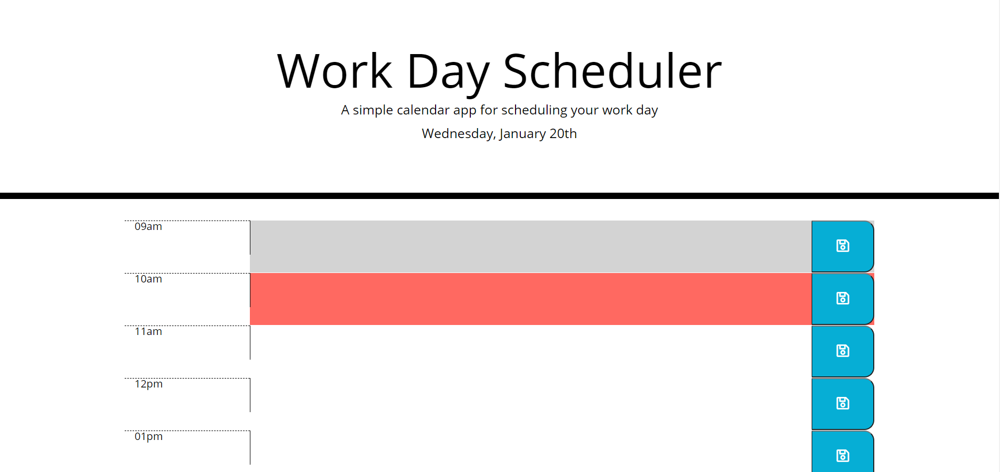

# work_day_calender

This is a work/school day planner I've created to better organize my day to day goals. I've made this using a variety of code including *HTML*, *CSS*, *JavaScript*, and *jQuery*.

## Table of Contents

* [Add Links into the HTML file](Add-Links-into-the-HTML-file)
* [Add external CSS and JS files](Add-external-CSS-and-JS-files)
* [Create a functional home page with an hourly calender](Create-a-functional-home-page-with-an-hourly-calender)
* [Providing a URL for the website](Providing-a-URL-for-the-website)
* [GitHub Live Site](GitHub-Live-Site)
* [Credits](Credits)
*[License](Liense)

## Add Links into the HTML file
1. Add Bootstrap Reference Links for *CSS* and *JavaScript* from the getbootstrap webpage
2. Add in the *jQuery* links
3. Add in *Google Fonts* link
4. Add in the *Font Awesome* link for the save button icon

## Add external CSS and JS files
1. Create and add the external *CSS* style sheet to the index.html file
2. Create and add the script tag for the JS file to the index.html file

## Create a functional home page with an hourly calender
1. Use *jQuery* to create a fully functional home page with time blocks from 9 a.m. to 5 p.m. where a user can input reminders or daily to dos.
2. Allow the user to save the data they input to the daily calender by saving it to local storage

## Providing a URL for the website
1. Open [Github.com](https://github.com/)
2. Create a new repository
3. Add a repository name and optional description
4. Make the repo public and add a README
5. Create repository
6. Inside the repo go to settings, scroll down to GitHub Pages and publish your site to the Branch: main

## GitHub Live Site
(https://wchenausky.github.io/work_day_calender/)

## Credits
* Marissa NeSmith (https://github.com/marissanesmith)
* Ethan Dutcher (https://github.com/edutcher)
* W3 Schools (https://w3schools.com)

# License
